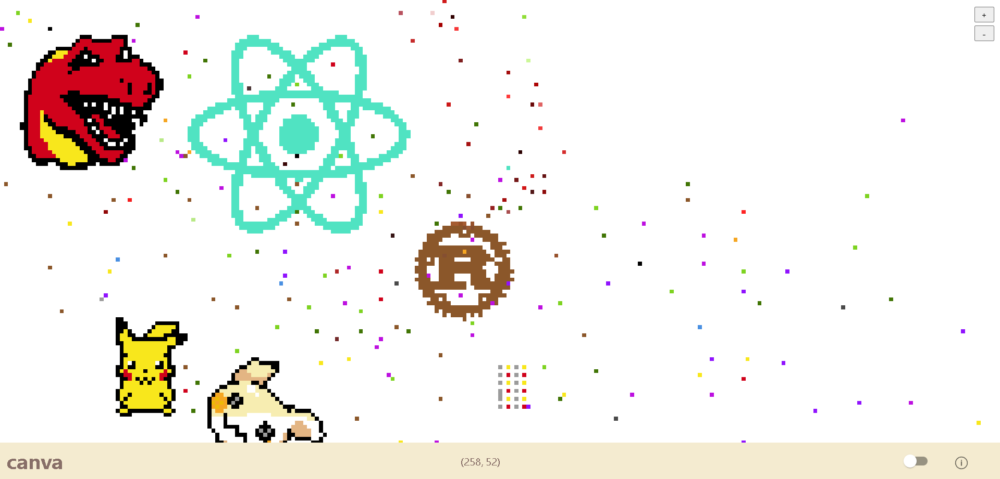

<h1 align="center">
  Canvas
</h1>

A distributed recreation of [r/place](https://en.wikipedia.org/wiki/R/place)

## Setup

### Frontend
Follow the instructions in [`the frontend readme`](frontend/README.md)

### Proxy
*Run before running npm start on frontend* 
Follow the instructions in [`the proxy readme`](proxy/README.md)

### Backend
Follow the instructions in [`the backend readme`](backend/README.md)

#### Setup csv tables
truncate canvas;
https://www.postgresqltutorial.com/postgresql-tutorial/import-csv-file-into-posgresql-table/

